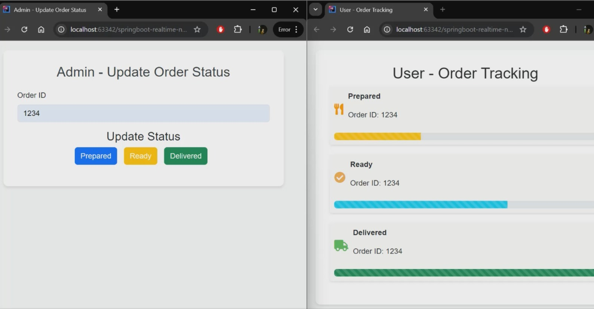

# Order Lifecycle Notification System with WebSocket

## Introduction

This project is a **real-time notification system** for tracking order status using **Spring Boot** and **WebSockets**. It bridges the gap between administrators updating order statuses and users tracking them, ensuring seamless, instant communication. 

---

## About the Project

### What does it do?
1. **Admin View**: Enables administrators to update order statuses (Prepared, Ready, Delivered).
2. **User View**: Displays order progress in real time with dynamic UI updates.




### Technologies and Concepts:
- **WebSockets** for real-time, bi-directional communication.
- **Spring Boot** for backend services and WebSocket endpoints.
- **Bootstrap** and **JavaScript** for responsive and interactive UI.
- **JSON Messaging** for data exchange.

---

## Real-Time Scenario

### Use Case: Food Delivery
- **Without Real-Time Updates**: Customers refresh pages or call for updates.
- **With This Project**: Instant notifications enhance customer experience, making order tracking effortless.

  ## Dependencies

This project uses the following key dependencies:

- **Spring Boot**: Framework for building the application.
- **Spring WebSocket**: To implement real-time communication.
- **Lombok**: To reduce boilerplate code, especially for data objects like `OrderUpdate`.
- **Bootstrap**: For creating responsive and elegant UI.
- **STOMP**: For message-oriented communication over WebSockets.

These dependencies allow us to create an interactive and dynamic web application for real-time order tracking.

---

## Key Components

### WebSocket Configuration

```java
@Configuration
@EnableWebSocket
public class WebSocketConfig implements WebSocketConfigurer {

    @Override
    public void registerWebSocketHandlers(WebSocketHandlerRegistry registry) {
        registry.addHandler(new WebSocketHandler(), "/ws")
                .setAllowedOrigins("*");  // Allowing connections from all origins for testing
    }
}
```

### WebSocket Configuration

#### Explanation:
- **WebSocketConfig**: This class configures the WebSocket handler for real-time communication.
- **`@EnableWebSocket`**: Enables WebSocket support in the application.
- **`registerWebSocketHandlers()`**: Maps the `/ws` endpoint for WebSocket connections, where clients will connect for real-time updates.

### Order Notification Controller

```java
@Controller
public class OrderNotificationController {

    @MessageMapping("/order/status")  // Endpoint to receive updates
    @SendTo("/topic/order")  // Broadcast updates to all subscribers
    public OrderUpdate sendOrderUpdate(OrderUpdate orderUpdate) {
        // Simulate order status update processing
        return orderUpdate;
    }
}
```
#### Explanation:
- **OrderNotificationController**: Handles incoming messages from the client (Admin).
- **`@MessageMapping("/order/status")`**: Listens for incoming messages from clients updating the order status.
- **`@SendTo("/topic/order")`**: Once an update is received, it is broadcasted to all clients subscribed to `/topic/order`, ensuring the users (Client2) see the status changes in real time.

### Flow of the Application

1. **`order.html`** (Client1) enters an Order ID and clicks a status button (e.g., "Prepared").
2. The **OrderUpdate** object, which contains the `orderId` and `status`, is sent to the WebSocket endpoint (`/app/order/status`).
3. The **OrderNotificationController** receives the message and processes it.
4. The controller then broadcasts the updated order status to all subscribers (here **`order-user-client.html`** which is Client2).
5. **`order-user-client.html`** (Client2), who is subscribed to `/topic/order`, receives the order update and sees it reflected in real-time on the tracking page.

This flow enables the admin to update the order status, and users will immediately see these changes without needing to refresh the page, ensuring a seamless experience.

## Front-End Flow and Logic

This project demonstrates the real-time order status updates via WebSocket. The front-end is responsible for displaying the order status and dynamically updating the UI without needing to refresh the page.

### Brief Overview:

- **WebSocket Connection**: The front-end connects to the WebSocket server at `/ws` using SockJS and STOMP for real-time communication.
- **Dynamic UI Update**: Once an order status update is received from the server, the front-end dynamically updates the order status on the page.
- **Admin Interaction**: The **`order.html`** (Client1) inputs the `Order ID` and selects a status (e.g., "Prepared"). The status update is sent to the server via WebSocket and broadcasted to all connected clients (e.g., **`order-user-client.html`** which is Client2).
- **Real-Time Status**: **`order-user-client.html`** (Client2) subscribed to `/topic/order` instantly see the status change without page reload.

The front-end logic is self-explanatory, focusing on receiving and displaying real-time updates through WebSocket.

> **Note**: Please go through the HTML files thoroughly to understand the front-end logic. This repository particularly focuses on how the WebSocket configuration and flow work using Spring Boot. The HTML and JS code is self-explanatory.

## How to Run It

To run the project and see the real-time order status update flow in action, follow the steps below:

1. **Start Your Spring Boot Application**:  
   Run the Spring Boot application from your IDE or through the terminal using the command:
   ```bash
   ./mvnw spring-boot:run
   ```
2. **Open User Page (user.html)**:  
   Open `src/main/resources/templates/users.html` in one browser tab. This page will display the order tracking.

3. **Open Admin Page (order-user-client.html)**:  
   Open `src/main/resources/templates/order-user-client.html` in another tab. This page allows the admin to update the order status.

4. **Keep Both Tabs Side-by-Side**:  
   Position both tabs side-by-side to observe the real-time updates. When the admin changes the order status, it will be instantly reflected on the user's tab.

Below is a video demonstrating how I tested the real-time order status flow:

[](video/order_status_demo.mp4)


